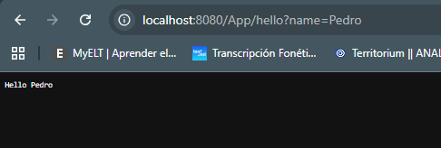
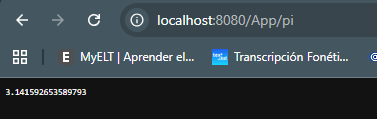
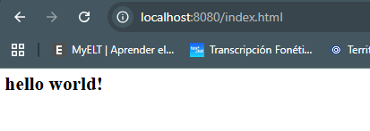
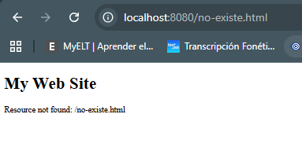

# Lab5-Arep - Web Framework Development for REST Services and Static File Management

This project consists of the development of a lightweight web framework in Java built on top of a custom HTTP server. The framework allows developers to register REST services using lambda expressions, extract query parameters from incoming HTTP requests, and configure the folder for serving static files such as HTML, CSS, JavaScript, and images. The project was built with Maven and Git, and it demonstrates core concepts of HTTP communication, internet architecture, and distributed application design through a hands-on implementation of a simple but functional web framework.

## Getting Started

These instructions will get you a copy of the project up and running on your local machine for development and testing purposes. See deployment for notes on how to deploy this on a live system.

The project includes three main framework features required by the lab:

1. A `get()` method to define REST endpoints with lambda functions.
2. A query extraction mechanism using `HttpRequest`.
3. A `staticfiles()` method to define the location of static resources.

The framework also includes an example application showing how a developer can publish REST services and serve static files.

## Prerequisites

What things you need to install the software and how to install them:

* **Java JDK 17 or higher**
* **Apache Maven 3.8+**
* **Git**
* An IDE such as **VS Code**, **IntelliJ IDEA**, or **NetBeans**


```bash
java -version
mvn -version
git --version
```

If these commands return installed versions, your environment is ready.

## Installing

A step by step series of examples that tell you how to get a development environment running.

### Clone the repository

```bash
git clone https://github.com/daviidc29/lab5-Arep
cd lab5-Arep
```

### Verify the project structure

The project should contain at least the following relevant packages and files:

```text
src
 └── main
     ├── java
     │   └── com.co.edu.escuelaing
     │       ├── server
     │       │   ├── HttpServer.java
     │       │   ├── HttpRequest.java
     │       │   ├── HttpResponse.java
     │       │   └── WebMethod.java
     │       └── appexamples
     │           └── App.java
     └── resources
         └── webroot
             └── index.html
```

### Compile the project

```bash
mvn clean compile
```

### Package the application

```bash
mvn package
```

### Run the example application

```bash
mvn exec:java -Dexec.mainClass="com.co.edu.escuelaing.appexamples.App"
```

If you prefer, you can also run the `App` class directly from your IDE.

### End with an example of getting some data out of the system or using it for a little demo

Once the server is running, open these URLs in your browser:

```text
http://localhost:8080/App/hello?name=Pedro
http://localhost:8080/App/pi
http://localhost:8080/index.html
```

Expected behavior:

* `/App/hello?name=Pedro` should return `Hello Pedro`
* `/App/pi` should return the value of `Math.PI`
* `/index.html` should return the static HTML file stored in `webroot`

## Project Architecture

The project is divided into two layers:

### 1. Framework layer

This is the reusable core of the server:

* `HttpServer`: receives HTTP requests, resolves endpoints, and serves static files.
* `HttpRequest`: parses the query string and exposes request values.
* `HttpResponse`: stores response metadata such as status code and content type.
* `WebMethod`: functional interface used to define REST services with lambdas.

### 2. Application layer

This shows how a developer uses the framework:

* `App`: registers static files and REST endpoints, then starts the server.

### Example of endpoint registration

From the final implementation:

```java
staticfiles("/webroot");

get("/App/hello", (req, resp) -> "Hello " + req.getValues("name"));
get("/App/pi", (req, resp) -> {
    return String.valueOf(Math.PI);
});

HttpServer.main(args);
```

## Implemented Features

### GET Static Method for REST Services

The framework provides a `get()` method that maps a URL path to a lambda expression:

```java
public static void get(String path, WebMethod wm) {
    endPoints.put(path, wm);
}
```

This allows simple REST service definitions such as:

```java
get("/App/pi", (req, resp) -> {
    return String.valueOf(Math.PI);
});
```

This feature fulfills the requirement of enabling developers to define REST services using lambda functions.

### Query Value Extraction Mechanism

The query extraction mechanism is implemented inside `HttpRequest`. The class stores the query string and parses it into a map:

```java
public String getValues(String varName) {
    return getValue(varName);
}
```

And the parsing logic is handled internally:

```java
private Map<String, String> parseQueryParams(String query) {
    Map<String, String> params = new HashMap<>();
    if (query == null || query.isEmpty()) {
        return params;
    }

    String[] pairs = query.split("&");
    for (String pair : pairs) {
        String[] keyValue = pair.split("=", 2);
        String key = decode(keyValue[0]);
        String value = keyValue.length > 1 ? decode(keyValue[1]) : "";
        params.put(key, value);
    }

    return params;
}
```

This makes requests like the following possible:

```text
http://localhost:8080/App/hello?name=Pedro
```

And enables the lambda to access the value using:

```java
req.getValues("name")
```

### Static File Location Specification

The framework provides a `staticfiles()` method so the developer can configure where static resources are located:

```java
public static void staticfiles(String path) {
    if (path == null || path.trim().isEmpty()) {
        staticFilesPath = "/webroot/public";
    } else {
        staticFilesPath = path.startsWith("/") ? path : "/" + path;
    }
}
```

This allows usage such as:

```java
staticfiles("/webroot/public");
```

If a requested path does not match a REST endpoint, the server tries to load it as a static file. For example:

```text
http://localhost:8080/index.html
```

### HTTP Request Handling

The server reads the first line of the HTTP request and extracts the method, path, and query:

```java
String[] flTokens = inputLine.split(" ");
method = flTokens[0];
String struripath = flTokens[1];
protocolversion = flTokens[2];

URI uripath = new URI(struripath);
reqpath = uripath.getPath();
requery = uripath.getQuery();
```

Then it creates the request and response objects:

```java
HttpRequest req = new HttpRequest(method, reqpath, protocolversion, requery);
HttpResponse res = new HttpResponse();
```

After that, the endpoint is resolved:

```java
WebMethod currentWm = endPoints.get(reqpath);
```

If the endpoint exists, the lambda is executed. Otherwise, the server attempts to return a static file.

## Running the tests

This project can be tested manually through end-to-end browser requests and, if desired, extended with JUnit tests for unit and integration validation.

### Break down into end to end tests

These tests verify that the framework behaves correctly from the client perspective: request arrives, server processes it, and a valid HTTP response is returned.

#### Test 1: REST endpoint returning a query value

Open:

```text
http://localhost:8080/App/hello?name=Pedro
```

Expected result:

```text
Hello Pedro
```



This test verifies:

* endpoint registration with `get()`
* query parsing
* access to request values inside a lambda

#### Test 2: REST endpoint returning a computed value

Open:

```text
http://localhost:8080/App/pi
```

Expected result:

```text
3.141592653589793
```


This test verifies:

* route resolution
* lambda execution
* plain text HTTP response generation

#### Test 3: Static file resolution

Open:

```text
http://localhost:8080/index.html
```

Expected result:

* the browser displays the HTML file stored in `resources/webroot/public`



This test verifies:

* `staticfiles()` configuration
* resource lookup
* content type handling for HTML

#### Test 4: Non-existing resource

Open:

```text
http://localhost:8080/no-existe.html
```

Expected result:

* a `404 Not Found` response page



This test verifies:

* missing route handling
* missing file handling
* fallback error response generation

### And coding style tests


Coding style tests verify that the project is consistently formatted, easy to maintain, and professionally structured. Even if the project does not currently include a Checkstyle or Spotless plugin, the code was written following these style criteria:

* meaningful class and method names
* clear package structure
* one responsibility per class
* readable indentation and formatting
* separation between framework logic and application logic


A style review can check that:

* `HttpServer` is responsible for request processing and response dispatching
* `HttpRequest` handles request data parsing
* `HttpResponse` stores response metadata
* `App` only configures routes and starts the framework

This separation makes the repository easier to understand and maintain.

## Deployment


## Built With

* **Java** - Main programming language
* **Maven** - Dependency management and build tool
* **Git** - Version control
* **Custom HTTP Server** - Lightweight web framework core built for this project

## Contributing

Please read `CONTRIBUTING.md` for details on our code of conduct, and the process for submitting pull requests to us. If it does not exist, you can create it.

## Versioning

We use SemVer for versioning. For the versions available, see the tags on this repository.

## Authors

* **David Santiago Castro** - Initial work
* See also the list of contributors who participated in this project.

## License

This project is licensed under the MIT License - see the `LICENSE.md` file for details.

## Acknowledgments

* Thanks to the Escuela Colombiana de Ingeniería for the academic context of this project.
* Inspiration from lightweight web frameworks that map routes to handlers.
* This project was developed as a practical exercise to better understand HTTP protocol architecture, internet architecture, and distributed application design.
